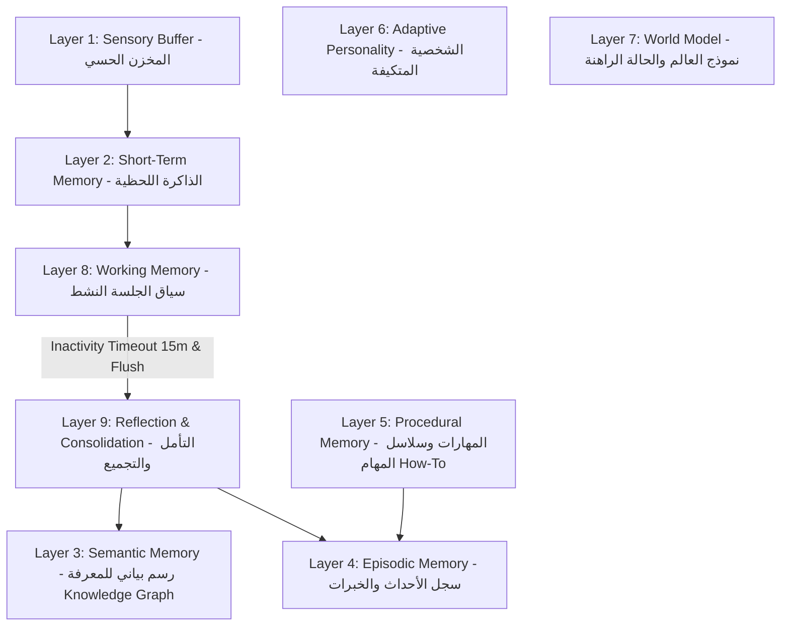

# 🧠 EyraOS — Cognitive Memory Architecture for Intelligent Robotics
### معمارية الوعي والذاكرة الإدراكية المستمرة للروبوتات الذكية

[](https://nodejs.org/)
[](https://ai.google.dev/)
[](https://visjs.org/)
[](https://opensource.org/licenses/MIT)

---

## 🌟 Overview / نظرة عامة

**EyraOS** is an autonomous cognitive memory architecture designed for intelligent robotics. Unlike traditional conversational agents that dump entire message logs into a static context window, EyraOS separates **persistent knowledge** from **ephemeral context**:

> **"Memory is persistent knowledge. Context is a temporary selection of relevant memory."**  
> *(الذاكرة معارف مستقرة دائمة... بينما السياق هو نافذة اختيار مؤقتة).*

EyraOS enables robots to continuously learn, resolve contradictions, acquire procedural skills, and consolidate experiences without cognitive degradation, hallucinations, or unbounded token consumption.

---

## 🏛️ The 9 Cognitive Memory Layers / طبقات الذاكرة التسع



1. **Layer 1: Sensory Buffer (المخزن الحسي):** Transitory buffer for real-time sensor streams (Vision/LiDAR/IMU).
2. **Layer 2: Short-Term Memory (الذاكرة قصيرة المدى):** Real-time conversational attention window.
3. **Layer 3: Semantic Memory (الذاكرة الدلالية):** Dynamic Knowledge Graph of typed entities and relations.
4. **Layer 4: Episodic Memory (الذاكرة العرضية):** Timestamped experiential episodes and interactions.
5. **Layer 5: Procedural Memory (الذاكرة الإجرائية):** Structured How-To skills, operational protocols, and step sequences.
6. **Layer 6: Adaptive Personality (الشخصية المتكيفة):** Evolving behavioral traits (Curiosity, Sociability, Caution).
7. **Layer 7: World Model (نموذج العالم):** Environmental awareness, battery state, and spatial presence.
8. **Layer 8: Working Memory (الذاكرة العاملة):** Active session buffer that decays and flushes after 15 minutes of inactivity.
9. **Layer 9: Reflection & Consolidation (التأمل وتثبيت المعرفة):** Offline high-level reasoning, pattern extraction, and entity deduplication.

---

## ⚡ Core Algorithmic Innovations / المحركات الابتكارية

### 1. Selective Tiered Retrieval (الاسترجاع الانتقائي الذكي)
Rather than loading the entire knowledge base into the LLM context, EyraOS parses Arabic queries, locates matching nodes, and performs **1-hop graph traversal**. Only relevant sub-graphs are supplied to Gemini 3.5 Flash Lite, slashing latency and eliminating context distraction:
> `🎯 استرجاع ذكي: 4/15 كيان (27%)`

### 2. Contradiction & Lifecycle Engine (محرك فض النزاعات)
Exclusive 1-to-1 relationships (such as `lives_in`, `works_as`, `status_is`) automatically transition older conflicting facts into a `superseded` state upon receiving new data. The system preserves cognitive history rather than blindly overriding or hallucinating contradictory facts.

### 3. Explicit Arabic Negation & Belief Revocation (إلغاء القناعات الصريح)
Phrases like *"أنا مبقتش عايش في إسكندرية"* are detected as **revocations**. The previous relationship is archived as `superseded` without polluting the graph with negative dummy nodes (`does_not_live_in`).

### 4. Dual-Stream Architecture & Session Lifecycle (المسار المزدوج)
- **Online Fast-Stream:** Fast extraction of primary entities and direct interaction.
- **Working Memory Buffer:** Tracks active dialog context with a 15-minute inactivity timer.
- **Offline Slow Consolidation:** Automatically triggers upon session expiration, summarizing the session into Episodic memory, deducing behavioral patterns, and **flushing working memory** to clear cognitive overhead.

### 5. Procedural Memory & Live Skill Learning (الذاكرة الإجرائية)
- **Dynamic In-Chat Learning:** Users can teach Eyra multi-step skills (e.g. motor diagnostics, calibration) directly in Arabic. Eyra parses the steps, saves the procedure, and renders an interactive checklist.
- **Execution Engine:** Simulates step-by-step procedure execution, logs the outcome to Episodic Memory (Layer 4), and updates execution statistics.

---

## 🚀 Quick Start / دليل البدء والتشغيل

### Prerequisites
- [Node.js](https://nodejs.org/) v18.0.0 or higher
- Google Gemini API Key ([Get one here](https://aistudio.google.com/))

### Installation

1. **Clone the repository:**
   ```bash
   git clone https://github.com/Yahia-Elhamzawy/EyraOS.git
   cd EyraOS
   ```

2. **Install dependencies:**
   ```bash
   npm install
   ```

3. **Configure environment variables:**
   ```bash
   cp .env.example .env
   ```
   Open `.env` and set your `GEMINI_API_KEY`:
   ```env
   GEMINI_API_KEY=your_actual_gemini_api_key_here
   PORT=3000
   ```

4. **Start the server:**
   ```bash
   npm start
   ```

5. **Open the interactive dashboard:**
   Navigate to [http://localhost:3000](http://localhost:3000) in your web browser.

---

## 📡 REST API Reference / مرجع واجهات البرمجة

| Method | Endpoint | Description |
|---|---|---|
| `POST` | `/api/chat` | Send user message, execute tiered retrieval, and update graph |
| `GET` | `/api/memory/graph` | Fetch complete knowledge graph (active & superseded) |
| `GET` | `/api/memory/stats` | Retrieve real-time memory statistics across all layers |
| `DELETE` | `/api/memory/entity/:name` | Delete a specific entity and all its relations |
| `DELETE` | `/api/memory/relation/:id` | Delete an individual relationship |
| `GET` | `/api/memory/procedures` | List all stored procedural skills and how-to protocols |
| `POST` | `/api/memory/procedure` | Add a new procedural skill with custom execution steps |
| `POST` | `/api/memory/procedure/:id/execute` | Execute and log a procedure into Episodic Memory |
| `DELETE` | `/api/memory/procedure/:id` | Delete a procedure from Layer 5 |
| `GET` | `/api/session` | Fetch active session state and working memory countdown |
| `POST` | `/api/session/timeout` | Trigger manual session consolidation and memory flush |
| `POST` | `/api/memory/consolidate` | Manually run Layer 9 cognitive reflection cycle |

---

## 🤖 Hardware & Robotics Roadmap / خارطة الانتقال للروبوت الفعلي

EyraOS is built from the ground up for embodiment on physical robots:
- **ROS 2 Action Client Bridge:** Mapping Layer 5 procedural steps directly to `Nav2` navigation goals and `ros2_control` actuators.
- **Sensory Buffer Integration:** Ingesting 3D point clouds and depth streams from Intel RealSense / LiDAR into Layer 1.
- **Edge Deployment:** Running quantized local SLMs (e.g. Gemma 2 / Llama 3) on NVIDIA Jetson Orin for offline autonomy.

---

## 📄 Documentation / التوثيق الإضافي

For comprehensive architectural design papers and detailed implementation notes, refer to:
- 📖 [doc.md](doc.md) — The Foundation Architecture Specification.
- 📋 [documentation.md](documentation.md) — Comprehensive Reference Manual (Arabic/English).

---

## 🛡️ License

This project is licensed under the MIT License — see the [LICENSE](LICENSE) file for details.

Developed with ❤️ for the future of Autonomous Robotic Intelligence.
