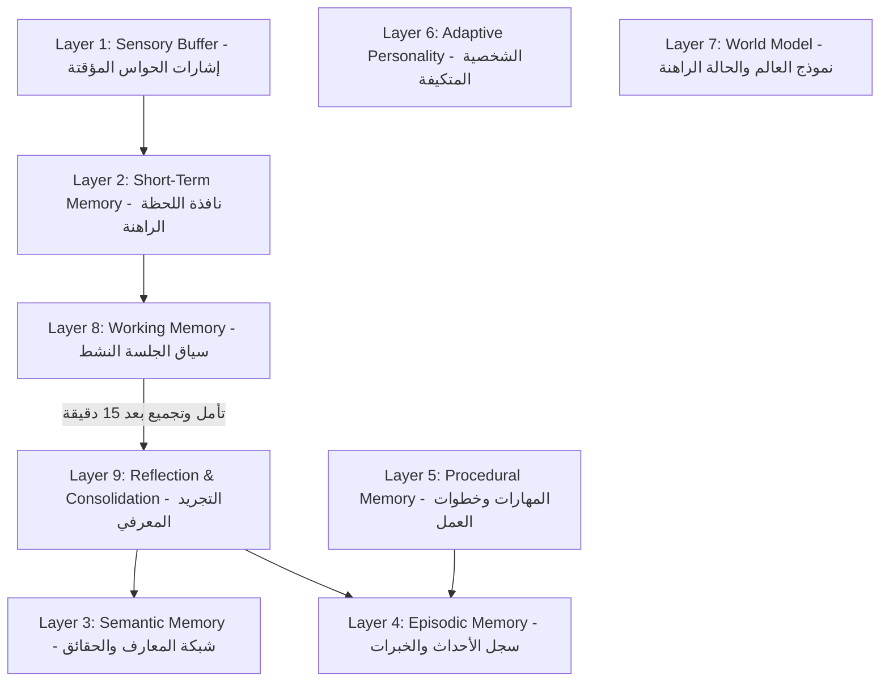
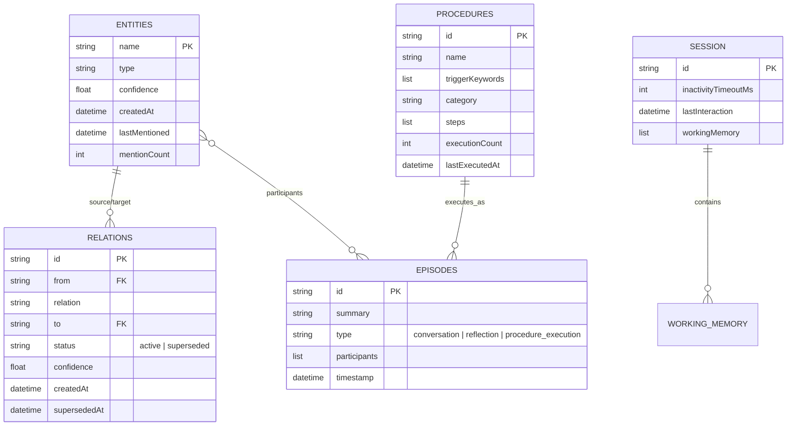
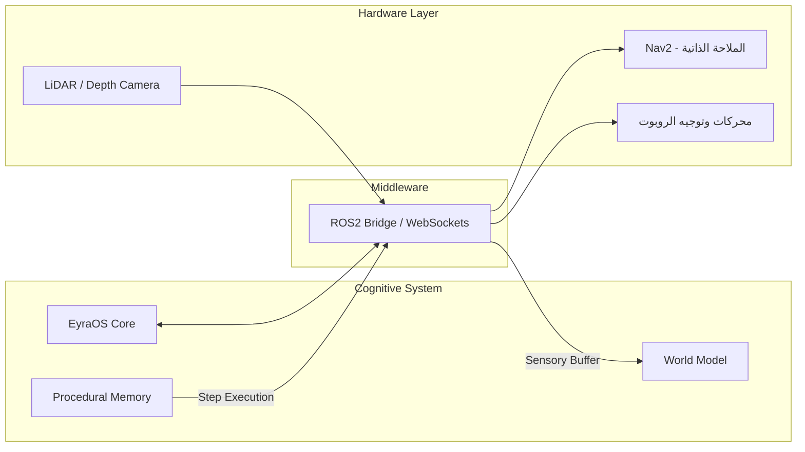

# EyraOS — الدليل الشامل والمعمارية المعرفية الكاملة
## التوثيق المرجعي الشامل لنظام الذاكرة الإدراكية للروبوتات الذكية

---

## 📑 فهرس المحتويات
1. [نظرة عامة وفلسفة النظام (System Overview & Philosophy)](#1-نظرة-عامة-وفلسفة-النظام)
2. [هيكل المشروع والملفات (Directory & Codebase Structure)](#2-هيكل-المشروع-والملفات)
3. [معمارية طبقات الذاكرة المعرفية التسع (The 9 Cognitive Memory Layers)](#3-معمارية-طبقات-الذاكرة-المعرفية-التسع)
4. [الخوارزميات والمحركات الابتكارية المطبقة (Core Engines & Algorithms)](#4-الخوارزميات-والمحركات-الابتكارية-المطبقة)
   - [أ. الاسترجاع الانتقائي الذكي (Selective Tiered Retrieval)](#أ-الاسترجاع-الانتقائي-الذكي-selective-tiered-retrieval)
   - [ب. محرك فض النزاعات وتاريخ القناعات (Contradiction & Lifecycle Engine)](#ب-محرك-فض-النزاعات-وتاريخ-القناعات-contradiction--lifecycle-engine)
   - [ج. محرك النفي وإلغاء القناعات الصريح (Negation & Belief Revocation)](#ج-محرك-النفي-وإلغاء-القناعات-الصريح-negation--belief-revocation)
   - [د. معمارية المسار المزدوج ودورة حياة الجلسة (Dual-Stream & Session Lifecycle)](#د-معمارية-المسار-المزدوج-ودورة-حياة-الجلسة-dual-stream--session-lifecycle)
   - [هـ. محرك الذاكرة الإجرائية والمهارات (Procedural Memory Engine - Layer 5)](#هـ-محرك-الذاكرة-الإجرائية-والمهارات-procedural-memory-engine---layer-5)
5. [بنية البيانات ومخطط الـ ERD (Data Schema & Storage)](#5-بنية-البيانات-ومخطط-الـ-erd)
6. [مرجع واجهات البرمجة الخلفية (REST API Reference)](#6-مرجع-واجهات-البرمجة-الخلفية-rest-api-reference)
7. [واجهة المستخدم والتفاعل البصري (Frontend UI/UX)](#7-واجهة-المستخدم-والتفاعل-البصري)
8. [دليل التثبيت والتشغيل (Setup & Operations Guide)](#8-دليل-التثبيت-والتشغيل)
9. [خارطة الطريق للانتقال للروبوت الحقيقي (Hardware & Robotics Transition)](#9-خارطة-الطريق-للانتقال-للروبوت-الحقيقي)

---

## 1. نظرة عامة وفلسفة النظام

تم تصميم وتطوير **EyraOS** ليكون نظام وعي وإدراك مستمر (Continuous Cognitive Consciousness) للروبوتات الذكية والمساعدات الذاتية، وليس مجرد غلاف تقليدي لنماذج اللغة الكبيرة (LLM Wrapper).

### الفلسفة الحاكمة:
> **الذاكرة معارف مستقرة دائمة... بينما السياق هو نافذة اختيار مؤقتة.**  
> *(Memory is persistent knowledge. Context is a temporary selection of relevant memory).*

في معظم أنظمة الدردشة التقليدية، يتم دفع كامل سجل المحادثات داخل نافذة السياق (Context Window)، مما يسبب ثلاثة عيوب قاتلة:
1. **استهلاك هائل للتوكنز والوقت (High Latency & Token Burn).**
2. **تشتت انتباه النموذج والهلوسة المعرفية (Context Distraction & Forgetting).**
3. **العجز عن الاستمرار الطويل؛** فبمجرد امتلاء النافذة ينهار الفهم المتراكم.

لذلك يعتمد **EyraOS** على **محرك ذاكرة مستقل (Memory Engine)** يفصل تخزين المعلومات عن نافذة السياق، ويسترجع فقط ما يلزم اللحظة الراهنة بدقة متناهية.

---

## 2. هيكل المشروع والملفات

تم تنظيم المشروع داخل مجلد معزول ومخصص هو `EyraOS` لضمان استقلالية الكود وكفاءته:

```text
تجربة/
├── EyraOS/                          # مجلد النظام المستقل الأساسي
│   ├── public/                      # الواجهة الأمامية التفاعلية
│   │   ├── index.html               # واجهة المستخدم بنظام التبويبات المتعددة
│   │   ├── style.css                # نظام التصميم البصري الحديث (Dark Glassmorphism)
│   │   └── app.js                   # المحرك التفاعلي للعميل (vis.js, timers, events)
│   ├── memory_store.json            # قاعدة البيانات المعرفية الموحدة
│   ├── server.js                    # خادم Node.js الخلفي ومحرك الإدراك المعرفي
│   ├── package.json                 # الاعتماديات والإعدادات
│   └── documentation.md             # هذا الدليل الشامل
├── doc.md                           # الوثيقة المعمارية التأسيسية
└── documentation.md                 # نسخة الدليل الشامل المرجعية
```

---

## 3. معمارية طبقات الذاكرة المعرفية التسع

يقسم نظام EyraOS الوعي والذاكرة إلى **9 طبقات متخصصة** لكل منها غرض، دورة حياة، وآلية تحديث محددة:



### تفاصيل الطبقات:
| الطبقة | الاسم الإنجليزي | الحالة الحالية | الوظيفة ودورة الحياة |
|---|---|---|---|
| **Layer 1** | **Sensory Buffer** | عابر (Hardware Ready) | يستقبل تدفق الحواس اللحظي (الكاميرا، الصوت، مستشعرات المسافة). يفرغ فوراً بعد المعالجة. |
| **Layer 2** | **Short-Term Memory** | نشطة | نافذة الانتباه اللحظي لما يقال أو يُرصد في آخر ثوانٍ. |
| **Layer 3** | **Semantic Memory** | **مفعلة وتنمو (Active)** | الذاكرة الدلالية: رسم بياني للمعرفة (Knowledge Graph) يتكون من كيانات (Entities) وعلاقات (Relations) مهيكلة. |
| **Layer 4** | **Episodic Memory** | **مفعلة (Active)** | ذاكرة الأحداث: توثيق التجارب ("ماذا حدث؟") مؤرخة زمنياً مع السياق وربطها بالكيانات المشاركة. |
| **Layer 5** | **Procedural Memory** | **مفعلة (Active)** | الذاكرة الإجرائية: معرفة "كيف تُنفذ المهام" (How-To) كسلاسل خطوات محددة للتشغيل، الفحص، والملاحة. |
| **Layer 6** | **Adaptive Personality** | مخطط (Planned) | الشخصية المتكيفة: معاملات الفضول، الاجتماعية، ونبرة الصوت التي تتطور تراكمياً مع الوقت. |
| **Layer 7** | **World Model** | مخطط (Real-time) | نموذج العالم: فهم الروبوت لمحيطه الفعلي، خريطة المكان، حالة البطارية، والأجهزة المتصلة. |
| **Layer 8** | **Working Memory** | **مفعلة (Active)** | الذاكرة العاملة: الاحتفاظ بسياق الحوار طالما أن الجلسة نشطة وتفريغها تلقائياً عند انقضاء مهلة عدم التفاعل. |
| **Layer 9** | **Reflection & Consolidation** | **مفعلة (Active)** | طبقة التأمل والتجميع: فحص الأحداث لاستخلاص استنتاجات عليا، دمج الكيانات المكررة، وترقية المعرفة. |

---

## 4. الخوارزميات والمحركات الابتكارية المطبقة

تم تزويد `EyraOS` بخمسة محركات برمجية غير مسبوقة تضمن كفاءة التفكير البشري:

### أ. الاسترجاع الانتقائي الذكي (Selective Tiered Retrieval)
* **المشكلة:** كبر حجم الـ Knowledge Graph بمرور الوقت يؤدي لتجاوز نافذة الـ Context ورفع التكلفة.
* **الحل البرمجي:**
  1. يقوم التابع `retrieveRelevantContext(userMessage)` في [server.js](file:///c:/Users/Abdallah/Desktop/تجربة/EyraOS/server.js) بتحليل رسالة المستخدم باللغة العربية لاستخراج الكلمات المفتاحية الدلالية.
  2. يتم مطابقة الكيانات الرئيسية واستخراج جيرانها المباشرين من الدرجة الأولى (1-Hop Graph Traversal).
  3. يتم استرجاع العلاقات النشطة (`active`) فقط المرتبطة بهذه العقد.
  4. يُمرر فقط هذا الرسم الجزئي (Sub-graph) إلى نموذج اللغة مع إحصائيات الاسترجاع:
     > `🎯 استرجاع ذكي: 4/15 كيان (27%)` لحماية الميزانية المعرفية ومنع التشتت.

### ب. محرك فض النزاعات وتاريخ القناعات (Contradiction & Lifecycle Engine)
* **المشكلة:** إذا قال المستخدم "أنا عايش في الإسكندرية" بعد أن كان قال سابقاً "أنا عايش في القاهرة"، تظل القاهرتان معاً في الجراف مما يسبب تضارباً وهلوسة!
* **الحل البرمجي:**
  1. حدد النظام العلاقات الحصرية (Exclusive 1-to-1 Relations) مثل `lives_in` و `status_is` و `works_as`.
  2. عند رصد معلومة جديدة مناقضة، يقوم المحرك في التابع `addRelation` بتحويل العلاقة القديمة إلى حالة `superseded` وتثبيت العلاقة الجديدة كـ `active`.
  3. لا يتم حذف المعلومة القديمة نهائياً، بل يُحتفظ بها كتاريخ معرفي يظهر بخط أحمر منقط عند تفعيل زر `⚡ الملغاة`.

### ج. محرك النفي وإلغاء القناعات الصريح (Negation & Belief Revocation)
* **المشكلة:** عند قول المستخدم: *"أنا مبقتش عايش في إسكندرية"*، كان الذكاء الاصطناعي ينشئ علاقة جديدة اسمها `does_not_live_in` فتبقى إسكندرية متصلة بالرسم البياني!
* **الحل البرمجي:**
  - تمت ترقية التوجيه المعرفي للنموذج (System Prompt) للتعرف على صيغ النفي العربية الصريحة (`مبقتش عايش في`, `مش شغال كذا`, `تركت`, `does_not_live_in`).
  - يتم التعامل معها كـ **إلغاء قناعة (Belief Revocation)**، فتحول العلاقة السابقة فورياً إلى `superseded` وتختفي تماماً من الرسم النشط دون إضافة عقد نفي سالبة وهمية.

### د. معمارية المسار المزدوج ودورة حياة الجلسة (Dual-Stream & Session Lifecycle)
* **المسار السريع الفوري (Online Fast-Stream):**
  - أثناء الحوار، يستخلص النظام الحقائق المباشرة فقط ويجيب بسرعة قصوى دون إرهاق النموذج بعمليات تفكير معقدة.
* **الذاكرة العاملة المؤقتة (Working Memory Buffer):**
  - تحتفظ بنصوص رسائل الحوار طوال استمرار الجلسة.
  - كل تفاعل يعيد ضبط مؤقت عدم النشاط (Inactivity Timeout) المحدد بـ **15 دقيقة**.
* **المسار البطيء المتأمل (Offline Post-Session Consolidation):**
  - عند انقضاء الـ 15 دقيقة (أو الضغط على زر `⚡ إنهاء وتأمل الجلسة`):
    1. يتأمل النظام الجلسة بنظرة شمولية عليا (Bird's-eye view).
    2. يستنتج أنماط السلوك والاهتمامات غير المباشرة ويثبتها في الـ Knowledge Graph.
    3. يوثق ملخص الجلسة كـ Episode في الذاكرة العرضية.
    4. **تفريغ الذاكرة العاملة (Working Memory Flush):** تصفير الذاكرة المؤقتة لتبدأ الجلسة القادمة بذهن صافٍ تماماً دون تراكم نصوص قديمة.

### هـ. محرك الذاكرة الإجرائية والمهارات (Procedural Memory Engine - Layer 5)
* **المفهوم:** تمكين الروبوت من تخزين وتنفيذ سلاسل الخطوات والبروتوكولات (How-To Skills).
* **المميزات المفعلة:**
  1. **التعلم التلقائي عبر الحوار:** عندما يشرح المستخدم أي خطوات، يستخلصها النظام تلقائياً ويسجلها كإجراء في Layer 5 مع عرض قائمة فحص خضراء في الشات.
  2. **الاستدعاء والمحاكاة:** يمكن تشغيل الإجراء إما عبر الأمر الصوتي/الكتابي ("نفذ كذا") أو عبر زر `⚡ تشغيل الإجراء` في لوحة التحكم، فيتم توثيق التنفيذ كـ Episode مع زيادة عداد مرات التنفيذ وعرض الخطوات كـ Checklist مكتمل.
  3. **إمكانية الإضافة اليدوية:** نافذة Modal ديناميكية لإضافة أي مهارة وتحديد خطواتها وكلماتها المفتاحية وتصنيفها.

---

## 5. بنية البيانات ومخطط الـ ERD

يتم حفظ كامل المعرفة في ملف مهيكل موحد [memory_store.json](file:///c:/Users/Abdallah/Desktop/تجربة/EyraOS/memory_store.json):



---

## 6. مرجع واجهات البرمجة الخلفية (REST API Reference)

يوفر الخادم الخلفي في `server.js` واجهات REST API شاملة:

### 1. المحادثة والتفاعل المعرفي
* **`POST /api/chat`**
  - **الوصف:** إرسال رسالة المستخدم ومعالجتها عبر المسار الفوري واسترجاع السياق الانتقائي.
  - **Body:** `{ "message": "أنا يحيى وعايش في الإسكندرية" }`
  - **Response:**
    ```json
    {
      "reply": "أهلاً يحيى! نورت إسكندرية...",
      "extractedEntities": [...],
      "extractedRelations": [...],
      "supersededRelations": [...],
      "matchedProcedure": null,
      "learnedProcedure": null,
      "executedProcedure": null,
      "retrievalStats": {
        "retrievedEntitiesCount": 4,
        "totalActiveEntities": 15,
        "retrievalPercentage": 27
      },
      "session": { "workingMemoryCount": 2, "remainingSeconds": 900 }
    }
    ```

### 2. الذاكرة الدلالية (Semantic Memory)
* **`GET /api/memory/graph`**: جلب جميع الكيانات والعلاقات (النشطة والملغاة).
* **`GET /api/memory/stats`**: إحصائيات الذاكرة (عدد الكيانات، العلاقات، الحلقات، الإجراءات).
* **`DELETE /api/memory/entity/:name`**: حذف كيان محدد وكافة علاقاته نهائياً من الجراف.
* **`DELETE /api/memory/relation/:id`**: حذف علاقة محددة بمعرفها.
* **`POST /api/memory/clear`**: إعادة تصفير الذاكرة للوضع الأولي.

### 3. التأمل والجلسات (Reflection & Sessions)
* **`GET /api/session`**: جلب حالة الجلسة الحالية والوقت المتبقي لانتهاء الصلاحية.
* **`POST /api/session/timeout`**: محاكاة فورية لانقضاء الـ 15 دقيقة وتفريغ الذاكرة العاملة وإجراء التأمل الختامي.
* **`POST /api/memory/consolidate`**: تشغيل يدوي لدورة التأمل والتجميع المعرفي (Layer 9).

### 4. الذاكرة الإجرائية (Procedural Memory - Layer 5)
* **`GET /api/memory/procedures`**: استعراض كافة الإجراءات والمهارات المخزنة.
* **`POST /api/memory/procedure`**: إضافة إجراء جديد بخطواته وتصنيفه وكلماته المفتاحية.
* **`POST /api/memory/procedure/:id/execute`**: محاكاة تنفيذ الإجراء وتوثيقه في الذاكرة العرضية.
* **`DELETE /api/memory/procedure/:id`**: حذف إجراء محدد من الذاكرة الإجرائية.

---

## 7. واجهة المستخدم والتفاعل البصري

تم تصميم الواجهة الأمامية بأحدث معايير التصميم المعاصر لتوفير تجربة مدهشة (State of the art):
1. **شاشة المحادثة والجراف (Chat & Knowledge Graph):**
   - عرض فوري لحركة الجراف التفاعلية باستخدام مكتبة `vis.js` مع فيزياء ارتدادية ثلاثية الأبعاد.
   - شارات ذكية على كل رسالة توضح نسبة الاسترجاع الانتقائي وفض النزاعات.
   - إمكانية الضغط على أي فقاعة لحذفها أو حذف علاقات فردية أو الضغط على زر `Delete` في الكيبورد.
   - زر تبديل لإظهار العلاقات الملغاة `⚡ الملغاة`.
2. **شاشة طبقات الذاكرة (Memory Layers Dashboard):**
   - استعراض تفاعلي للطبقات التسع مع شارات الحالة (`Active ✓`, `Growing`, `Skills & How-To`, `Decay & Flush`).
   - تحكم كامل بالمهارات الإجرائية: استعراض الخطوات، إضافة مهارات جديدة، وتشغيل الإجراءات.
   - عداد حي ومؤشر نبضي لحالة الجلسة وزر تفريغ الذاكرة المؤقتة.
3. **شاشة مخطط البيانات (Live ERD Schema):**
   - رسم بياني حي لجداول قاعدة البيانات وصفوفها الفعلية مع خطوط ربط ديناميكية باستخدام SVG ترسم العلاقات بين الجداول.

---

## 8. دليل التثبيت والتشغيل

### المتطلبات الأساسية:
- بيئة **Node.js** (إصدار 18 فما فوق).
- مفتاح Google Gemini API Key (مدمج وجاهز في `server.js`).

### خطوات التشغيل:
1. افتح موجه الأوامر (PowerShell أو Terminal) داخل مجلد المشروع:
   ```bash
   cd c:\Users\Abdallah\Desktop\تجربة\EyraOS
   ```
2. تثبيت الحزم (إذا لزم الأمر):
   ```bash
   npm install
   ```
3. تشغيل خادم النظام:
   ```bash
   node server.js
   ```
4. افتح المتصفح على العنوان:
   👉 **`http://localhost:3000`**

### إيقاف السيرفر:
- للإنهاء السريع اضغط `Ctrl + C` في الطرفية، أو أغلق العملية عبر مدير المهام.

---

## 9. خارطة الطريق للانتقال للروبوت الحقيقي

بعد التحقق التام من كفاءة المعمارية المعرفية الحالية برمجياً، تمهد هذه المنظومة للانتقال المباشر نحو الهاردوير الفعلي عبر الخطوات التالية:



1. **الربط مع نظام تشغيل الروبوتات (ROS 2 Bridge):**
   - ربط الذاكرة الإجرائية (Layer 5) بـ **ROS2 Action Servers** و **Behavior Trees**، بحيث تتحول خطوات الإجراء البرمجية (مثل `proc_docking`) إلى أوامر حركة واقعية عبر مكتبة `Nav2`.
2. **تغذية المخزن الحسي (Sensory Buffer):**
   - ربط إشارات كاميرات الرؤية ثلاثية الأبعاد (Intel RealSense) ومستشعر الليزر (LiDAR) بالمخزن الحسي اللحظي للروبوت وتحديث الـ World Model آنياً.
3. **التشغيل المحلي التام (Local On-Device Reasoning):**
   - إمكانية تشغيل نماذج تفكير محلية خفيفة (مثل Gemma 2 / Llama 3 quantized) على معالجات الروبوت (NVIDIA Jetson Orin) للحفاظ على الاستقلالية التامة في حال انقطاع الإنترنت.

---
**تاريخ إصدار التوثيق:** سبتمبر 2026  
**فريق التطوير:** مشروع الوعي المعرفي الذاتي — EyraOS Team
